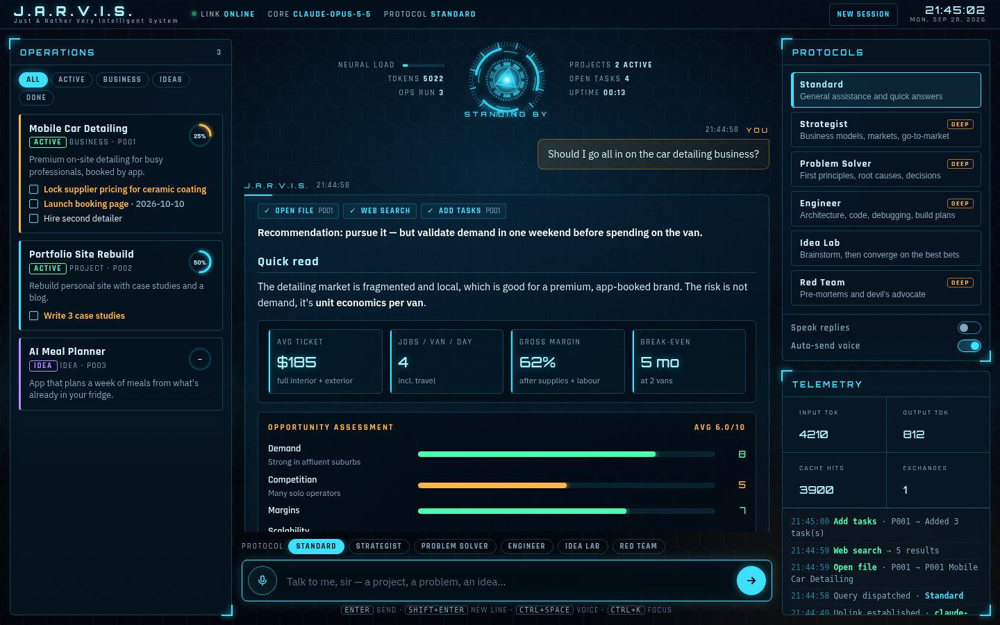

# J.A.R.V.I.S.

A personal AI chief of staff in the style of Iron Man's Jarvis, powered by Claude.
Run it as a **holographic web HUD** in your browser, or as a text/voice assistant in
your terminal. It keeps a persistent workspace of your projects, businesses and ideas
and helps you plan, decide and solve problems with them.



## What it does

- **Holographic HUD**: an animated arc-reactor core that reacts when Jarvis is
  thinking, listening or speaking, plus streaming replies, a boot sequence, live
  telemetry and an activity log. It works on desktop and phones.
- **Operations workspace**: projects, businesses and ideas, each with goals, tasks
  (priorities and due dates), a decision log, field notes and saved briefs. Jarvis
  reads and updates it as you talk. You can also tick tasks off in the dashboard.
- **Protocols**: working modes that change how Jarvis thinks.

  | Protocol | Use it for |
  |---|---|
  | Standard | Everyday questions and quick help |
  | Strategist | Business models, market sizing, unit economics, go-to-market |
  | Problem Solver | First principles, root causes, options matrix, recommendation |
  | Engineer | Architecture, code, debugging, build plans |
  | Idea Lab | Brainstorm widely, then score and pick the best bets |
  | Red Team | Pre-mortems and devil's advocate |

  Strategist, Problem Solver, Engineer and Red Team (marked DEEP) run at higher
  reasoning effort.
- **Rich answers**: Markdown with tables, plus **scorecards** (animated 0–10
  gauges) and **metric tiles** that Jarvis uses for assessments and numbers.
- **Live web search**, using Claude's built-in search. Sources appear as links
  under each answer.
- **Voice** in the browser: click the reactor or press `Ctrl+Space` to talk. It can
  read replies aloud in a British voice. Chrome, Edge or Safari recommended.

## Setup

```bash
python3 -m venv .venv
source .venv/bin/activate
pip install -e .

cp .env.example .env
# then edit .env and set ANTHROPIC_API_KEY
```

## Usage

### HUD (recommended)

```bash
jarvis-hud            # or: jarvis --hud
```

This opens `http://localhost:8765` in your browser. Options: `--port 9000`,
`--no-browser`, and `--host 0.0.0.0` to reach it from your phone on the same
network. There is no authentication, so only expose it on networks you trust.

Things to try:

- *"I want to start a mobile car detailing business — track it and pressure-test the idea."*
- *"Give me a briefing across all my projects."*
- Switch to **Red Team**: *"Run a pre-mortem on P001."*
- Switch to **Problem Solver**: *"Sales dropped 30% this month and I don't know why."*
- Click a project card for its tasks, decisions and briefs, plus one-click
  *Status brief*, *Next actions* and *Pre-mortem* buttons.

Keyboard: `Enter` sends, `Shift+Enter` adds a new line, `Ctrl+Space` starts voice,
`Ctrl+K` focuses the input, and `Esc` closes panels and stops speech.

### Terminal

```bash
jarvis                              # text chat
jarvis --protocol strategist        # pick a protocol
jarvis --once "What's 12 times 7?"  # one-off, scriptable
jarvis --voice                      # wake word + mic + speech (needs the voice extra)
```

Terminal voice mode needs `pip install -e ".[voice]"` and PortAudio
(`brew install portaudio` / `sudo apt-get install portaudio19-dev`). The HUD
does not need any of this, because it uses the browser's speech APIs.

## Configuration

All settings are read from environment variables (see `.env.example`):

| Variable | Default | Purpose |
|---|---|---|
| `ANTHROPIC_API_KEY` | *(required)* | Your Claude API key |
| `JARVIS_MODEL` | `claude-opus-5-5` | Which Claude model to use |
| `JARVIS_EFFORT` | `medium` | Default reasoning effort. DEEP protocols use `high` |
| `JARVIS_WEB_SEARCH` | `true` | Enable Claude's web search tool |
| `JARVIS_FALLBACKS` | `true` | Server-side fallback model if a request is declined |
| `JARVIS_DATA_DIR` | `~/.jarvis` | Where the workspace, notes and reminders live |
| `JARVIS_NAME` | `Jarvis` | Assistant's name |
| `JARVIS_WAKE_WORD` | `jarvis` | Wake word for terminal voice mode |
| `JARVIS_VOICE` | `false` | Start the terminal assistant in voice mode |
| `OPENWEATHER_API_KEY` | *(optional)* | Enables the `get_weather` tool |

The workspace is one readable JSON file, `~/.jarvis/workspace.json`. Back it up
or sync it however you like.

## Architecture

```
src/jarvis/
  config.py        Settings + the Jarvis persona/system prompt
  protocols.py     Working modes (Strategist, Problem Solver, ...)
  llm.py           Claude streaming loop: tools, web search, fallbacks, UI events
  server.py        Stdlib HTTP server for the HUD (NDJSON streaming chat API)
  web/index.html   The HUD (single file: HTML/CSS/JS, arc reactor on <canvas>)
  web/vendor/      Bundled marked + DOMPurify (so the HUD works offline)
  assistant.py     Terminal text/voice loop
  main.py          CLI entry points (jarvis, jarvis-hud)
  tools/
    registry.py    Tool registration/dispatch shared with Claude's tool-use API
    builtin.py     time/date, calculator, notes, reminders, weather
    workspace.py   projects, tasks, decisions, notes, briefs
  speech/          Terminal-mode mic/speaker support
```

HUD API: `GET /api/status`, `GET /api/workspace`, `POST /api/chat` (streams
newline-delimited JSON events: `text`, `tool`, `usage`, `notice`, `error`, `done`),
`POST /api/task`, `POST /api/reset`.

## Adding a new tool

Add a function to `src/jarvis/tools/builtin.py`, or to a new module imported
from `tools/__init__.py`, and decorate it with the shared registry:

```python
@registry.register(
    name="my_tool",
    description="What this tool does, written for the model to read.",
    input_schema={
        "type": "object",
        "properties": {"arg": {"type": "string"}},
        "required": ["arg"],
    },
)
def my_tool(arg: str) -> str:
    return f"did something with {arg}"
```

Claude can use it on the next request, and the HUD shows it as a chip while it
runs. To give it a friendly label, add it to `TOOL_LABELS` in `web/index.html`.

## Tests

```bash
pip install -e ".[dev]"
pytest
```

Tests fake the Anthropic client and the filesystem, so they run without an API
key, network access or a microphone.
